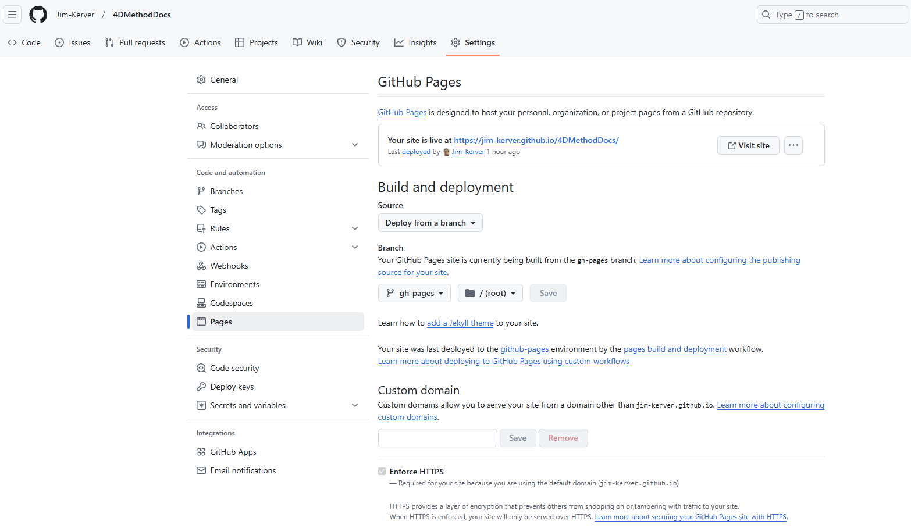

# Deployment

We will be deploying our website using [GitHub Pages](https://pages.github.com/). You can use this for free if your repo is public. Private repos can only be deployed with a GitHub [PRO](https://github.com/pricing) account.

:::tip
GitHub Pages can be used to host any static website.
:::

The [Official Deployment Documentation](https://docusaurus.io/docs/deployment#deploying-to-github-pages) is a great explanation on how to set this up. It also lists alternative deployment methods.

---

## Docusaurus Config File
First, we will have to change the links in the docusaurus config file.

```js title="docusaurus.config.js"
// @ts-check
// `@type` JSDoc annotations allow editor autocompletion and type checking
// (when paired with `@ts-check`).
// There are various equivalent ways to declare your Docusaurus config.
// See: https://docusaurus.io/docs/api/docusaurus-config

import {themes as prismThemes} from 'prism-react-renderer';

// This runs in Node.js - Don't use client-side code here (browser APIs, JSX...)

/** @type {import('@docusaurus/types').Config} */

const config = {
  title: '4D Method',
  tagline: 'Documentation made beautiful',
  favicon: 'img/favicon.ico',

  // Set the production url of your site here
  //highlight-next-line
  url: 'https://jim-kerver.github.io',

  // Set the /<baseUrl>/ pathname under which your site is served
  // For GitHub pages deployment, it is often '/<projectName>/'
//highlight-next-line
  baseUrl: '/4DMethodDocs/',

  

  // GitHub pages deployment config.
  // If you aren't using GitHub pages, you don't need these.
//highlight-start
  organizationName: 'Jim-Kerver', // Usually your GitHub org/user name.
  projectName: '4DMethodDocs', // Usually your repo name.
  deploymentBranch: 'gh-pages',
  trailingSlash: false,
  //highlight-end
```

## Deploy from command line
run the following command:
```bash
$ GIT_USER=<Your GitHub username> npm run deploy
```
>You might get a popup to login to GitHub if this is your first time.

>This action does not seem to work using the Windows terminal/powershell. Using Git Bash is advised.

When the command has finished, your website should be up. Follow the link in the terminal to see it!


---
### GitHub Pages settings
After deployment, branch `gh-pages` should have been automatically created on github. Also, the GitHub pages settings should be set correctly. It should look a little something like this:


:::info
In case you want to use your custom domain for GitHub Pages, create a `CNAME` file in the `static` directory. Anything within the `static` directory will be copied to the root of the `build` directory for deployment. When using a custom domain, you should be able to move back from `baseUrl: '/projectName/'` to `baseUrl: '/'`, and also set your `url` to your custom domain.

You may refer to GitHub Pages' documentation [User, Organization, and Project Pages](https://help.github.com/en/articles/user-organization-and-project-pages) for more details.
:::