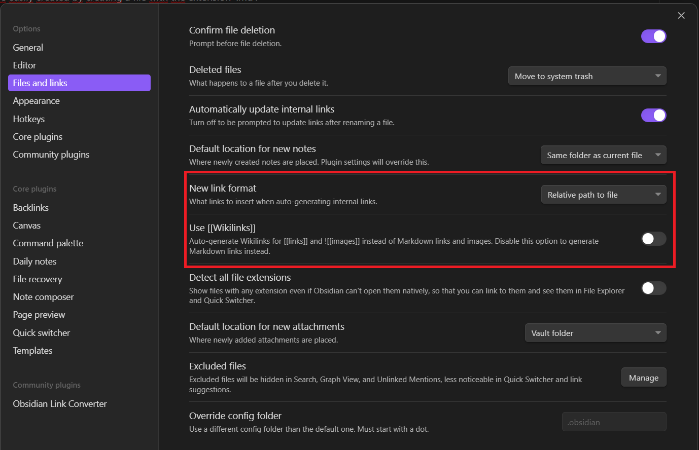
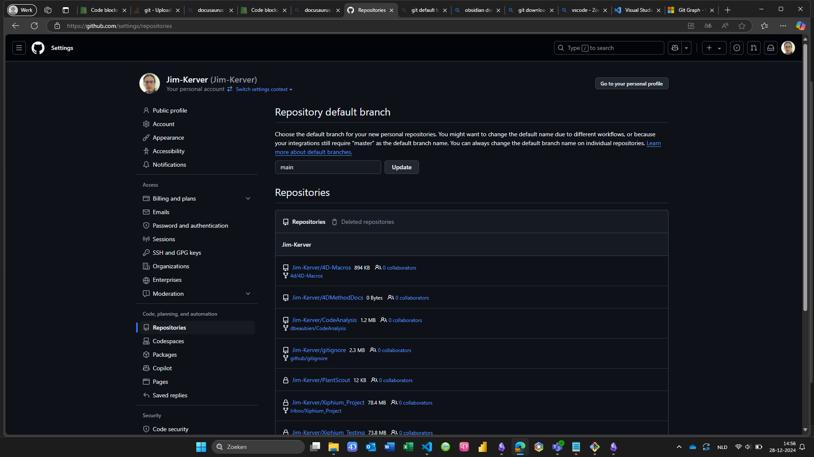
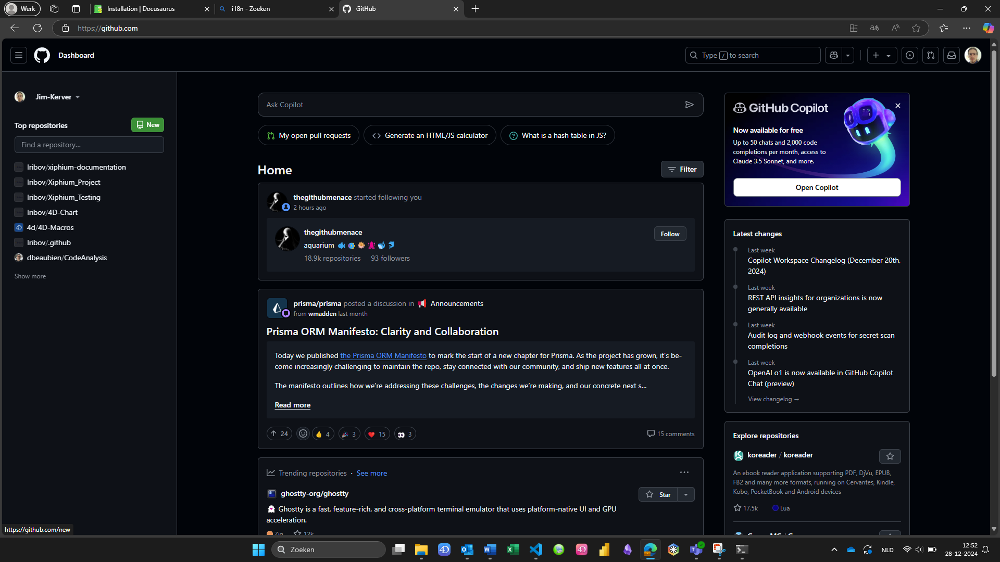
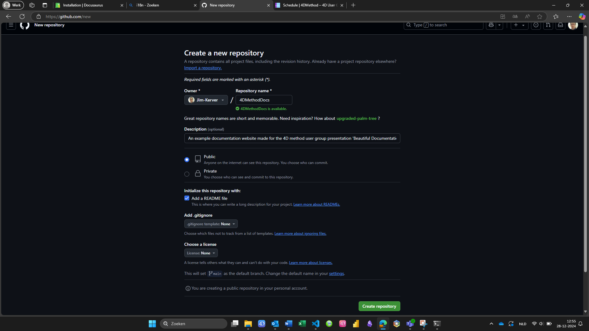
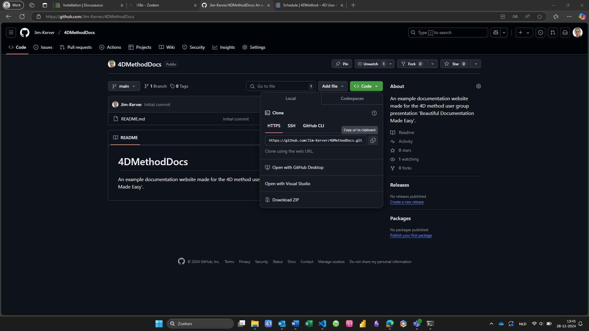

# Getting started

Get started by **creating a new site**. We will install and setup our other tools.

Keep with me, this is the most difficult part!

### What you'll need
- [Obsidian](https://obsidian.md/) or your preferred markdown editor
- [Git](https://git-scm.com/downloads)
- An account on [GitHub](https://github.com/)
- [Node.js](https://nodejs.org/en/download/) version 18.0 or above:
  - When installing Node.js, you are recommended to check all check boxes related to dependencies.

#### Recommended

- [Visual Studio Code](https://code.visualstudio.com/) as a file editor, Git GUI and terminal
	- with an extension such as [Git Graph](https://marketplace.visualstudio.com/items?itemName=mhutchie.git-graph)

## Configurations
All the tools that we will use must be configured properly.

### Obsidian
There are a few standards for certain thing withing the markdown language. Let's configure Obsidian to use the same standards as Docusaurus. This will create the most user friendly experience!

In the settings (cogwheel on left bottom), go to 'Files and Links'. Set the 'New link format' to 'Relative path to file' and turn off the 'Use [[WikiLinks]]' option (as seen on the screenshot below).

These settings will ensure that pasted links and images will be linked to according to the Docusaurus format.

### Git
After installing git, make sure to enter you credentials so they can be used whenever a commit is made. This is easily done in the terminal
>git bash is recommended to use on Windows

```bash
git config --global user.name "yourName"
git config --global user.email yourEmail@example.com
```

:::tip modern branch name
If you want to follow modern Git practices, rename the default branch `master` to `main`. This settings make sure that when initializing a new git repo, the default branch is named `main`
```bash
git config --global init.defaultBranch main
```
:::
### GitHub
Creating an account on [GitHub](https://github.com/) should be straightforward.

:::note modern branch name
If you want to be modern, make sure to change your default branch name to 'main' instead of 'master'.
Go to [Repository settings](https://github.com/settings/repositories) and change the default branch name to `main`.
:::

## Generate a new site
>for this part, you need to have installed Node.js.

Generate a new Docusaurus site using the **classic template**.

The classic template will automatically be added to your project after you run the command:

```bash
npm init docusaurus@latest my-website classic
```

You can type this command into Command Prompt, Powershell, Terminal, or any other integrated terminal of your code editor.

The command also installs all necessary dependencies you need to run Docusaurus.

## Start your site

Run the development server:

```bash
cd my-website
npm run start
```

The `cd` command changes the directory you're working with. In order to work with your newly created Docusaurus site, you'll need to navigate the terminal there.

The `npm run start` command builds your website locally and serves it through a development server, ready for you to view at http://localhost:3000/.

Open `docs/intro.md` (this page) and edit some lines: the site **reloads automatically** and displays your changes.

## Git(Hub)
To keep track of the changes we've made, let's put our project under version control using Git, and upload it to GitHub.

### Github

<details>
<summary>GitHub Modern practice</summary>

Set the default branch name `main` instead of 'master' if you want to follow modern git practices. Go to settings (via your profile picture in the right upper corner), navigate to 'repositories' and change the default branch name.


</details>

First, create a new repository in GitHub:

You can name you repo however you like:

> A description is not necessary, we will overwrite this later with a force push.

Copy the git repo link of this new repository and use it in the next step.

### Git
>for this part, you need to have installed Git

After you have installed and Configured Git, let's put our new project under version control.

In a terminal, first navigate to your folder using `cd your/project/folder/location`.
Then, execute the following lines 1 by 1:
```bash
git init
git add .
git commit -m "initial commit"
```

:::tip
Rename the `master` branch to `main` if you want to follow modern git practices. This is not necessary if you changed your git configuration.
```bash
git branch -m master main
```
:::
```bash
git remote add origin https://github.com/my_username/my_project.git
git branch --set-upstream-to=origin/main main
git push -f
```

:::note
If you haven't renamed your local branch to `main`, use `master` instead.

If you haven't renamed your GitHub branch to `main`, use `origin/master`.
:::

All your changes from now on are under version control.
Check your GitHub repo to see if your commit has been uploaded!